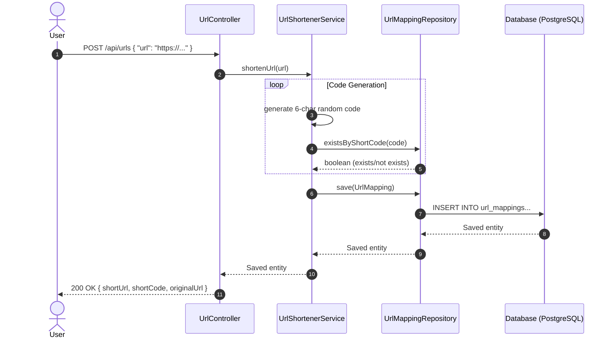
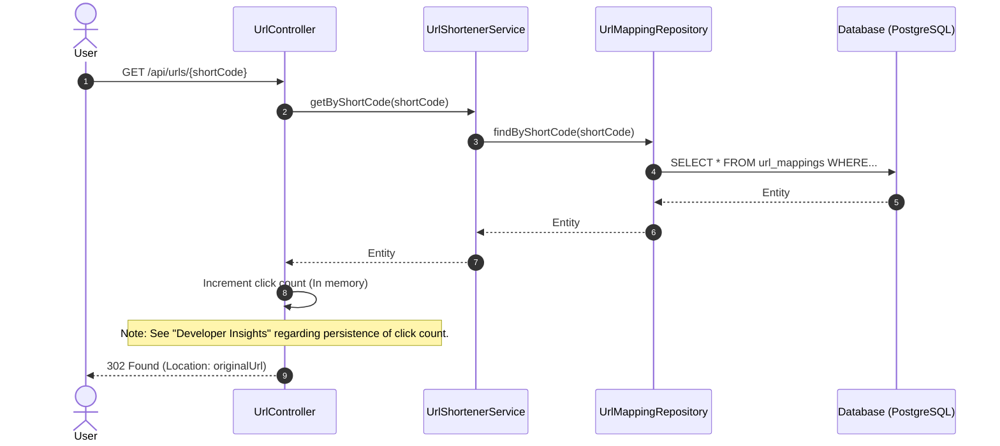

# 🔗 URL Shortener REST API

[](https://spring.io/projects/spring-boot)
[](https://openjdk.org/projects/jdk/26/)
[](https://www.postgresql.org/)
[](https://opensource.org/licenses/MIT)

A lightweight, high-performance RESTful URL Shortener service built with **Spring Boot** and **PostgreSQL**. This service allows users to convert long, cumbersome URLs into compact, 6-character unique codes and redirects users to the original URL when accessed.

---

## ✨ Features

- **URL Shortening**: Generates a secure, random 6-character alphanumeric code for any valid HTTP/HTTPS URL.
- **Redirection**: Instant HTTP 302 redirection from the short code to the original URL.
- **Duplicate Prevention**: Automatically regenerates short codes in case of collisions.
- **Lombok Integration**: Boilerplate-free, clean Java records and builder patterns.
- **Robust Validation**: Input validation to ensure only properly formatted URLs are shortened.
- **PostgreSQL Backed**: Uses a production-ready PostgreSQL database for data persistence.

---

## 🛠️ Tech Stack & Dependencies

- **Framework**: Spring Boot (v4.1.1)
- **Language**: Java 26
- **Database**: PostgreSQL (v18.3)
- **ORM**: Spring Data JPA / Hibernate (v7.4.5.Final)
- **Connection Pool**: HikariCP
- **Validation**: Jakarta Validation API
- **Build Tool**: Gradle 9.5.1
- **Developer Utilities**: Lombok (compile-only annotation processor)

---

## 📐 System Architecture & Workflows

### 1. URL Shortening Workflow (`POST /api/urls`)



### 2. URL Redirection Workflow (`GET /api/urls/{shortCode}`)



---

## 💾 Database Schema

The application maps URL associations using a single entity, `UrlMapping`, which translates to the `url_mappings` table:

| Column Name | Data Type | Constraints | Description |
| :--- | :--- | :--- | :--- |
| `id` | `BIGINT` | `PRIMARY KEY`, `GENERATED BY DEFAULT AS IDENTITY` | Unique database identifier |
| `original_url` | `VARCHAR(2048)` | `NOT NULL` | The original target URL (max length 2048 characters) |
| `short_code` | `VARCHAR(10)` | `NOT NULL`, `UNIQUE` | The unique 6-character lookup key |
| `click_count` | `BIGINT` | `NOT NULL`, `DEFAULT 0` | Total redirection clicks tracked for this link |

---

## 🔌 API Reference

### 1. Shorten URL
- **Endpoint**: `POST /api/urls`
- **Content-Type**: `application/json`
- **Request Body**:
  ```json
  {
    "url": "https://github.com/sukhmmeet/URL-Shortener-REST-API"
  }
  ```
- **Response (200 OK)**:
  ```json
  {
    "originalUrl": "https://github.com/sukhmmeet/URL-Shortener-REST-API",
    "shortCode": "Ab8D2k",
    "shortUrl": "http://localhost:8080/Ab8D2k"
  }
  ```

### 2. Redirect Short URL
- **Endpoint**: `GET /api/urls/{shortCode}`
- **Response**: `302 Found`
- **Headers**:
  - `Location`: The original URL to redirect to.

---

## 🚀 Getting Started

### Prerequisites
- **JDK 26** installed on your system.
- **PostgreSQL** instance running locally.
- **Gradle** (or use the provided Gradle wrapper `./gradlew`).

### ⚙️ Environment Variables
The application reads database credentials from environment variables. Set the following variables before running:

| Variable | Description | Example Value |
| :--- | :--- | :--- |
| `LOCAL_DB_USERNAME` | Database user | `postgres` |
| `LOCAL_DB_PASSWORD` | Database password | `yourpassword` |

### 🛠️ Setup Database
Create a database named `urlshortener` in PostgreSQL:
```sql
CREATE DATABASE urlshortener;
```

### 🏃 Running the Application
1. Clone the repository and navigate to the project directory.
2. Build the project:
   ```bash
   ./gradlew build
   ```
3. Run the Spring Boot application:
   ```bash
   ./gradlew bootRun
   ```
4. Access the API at `http://localhost:8080`.

---

## 💡 Developer Insights & Recommendations

During a quick code review, we noticed a minor bug regarding the click statistics:

> [!WARNING]
> **Click Count Persistence Issue**
> In the `UrlController.java`'s redirection endpoint, the `clickCount` is incremented in memory on the `UrlMapping` object:
> ```java
> UrlMapping mapping = service.getByShortCode(shortCode);
> mapping.setClickCount(mapping.getClickCount() + 1);
> ```
> However, because there is no `@Transactional` context or explicit call to `repository.save(mapping)`, this increment is **never saved back to the database**.
>
> **How to Fix**:
> Modify the controller or service method to persist the updated entity:
> ```java
> // In UrlController
> mapping.setClickCount(mapping.getClickCount() + 1);
> service.save(mapping); // or call repository.save(mapping) directly
> ```